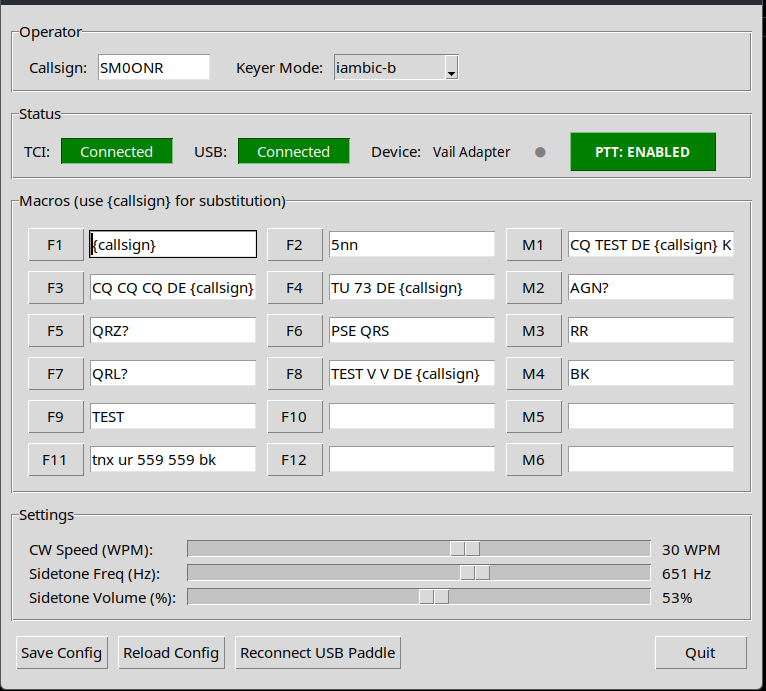

# TCI CW Controller

CW keyer application for SunSDR radios via TCI (Transceiver Command Interface) protocol.

## Features

✅ **Graphical User Interface** - Tkinter-based GUI for easy operation  
✅ **F1-F12 Keyboard Macros** - Send predefined CW messages (click or press F-keys)  
✅ **USB Paddle Support** - Manual CW keying via XIAO SAMD21 microcontroller  
✅ **Local Sidetone** - Instant audio feedback  
✅ **Vail Adapter Support** - Hardware-based iambic keyer with 9 keyer modes  
✅ **Live Configuration** - Edit macros and settings without restarting  



**Modes:**
- **GUI Mode** (recommended) - Visual interface with status indicators and macro editor
- **CLI Mode** - Lightweight terminal-only operation

## Quick Start

### Option 1: Use Pre-built Binary (Easiest)

Download pre-built executables from [releases](https://github.com/tompatulpan/TCI-Keyer/tree/main/dist):
- **Linux**: `tci-cw-controller` (no Python installation required)
- **Windows**: `tci-cw-controller.exe` (coming soon)

Extract and run:
```bash
# Linux
chmod +x tci-cw-controller
./tci-cw-controller --gui
```

Then edit `config.yaml` or direct in GUI (and save to config.yaml) to set your callsign and customize macros.

### Option 2: Run from Source

#### 1. Install
```bash
pip install -r requirements.txt
```

##### 2. Configure
Edit `config.yaml`:
```yaml
operator:
  callsign: "SM0ONR"      # Your callsign

tci:
  host: "localhost"     # TCI server (check ExpertSDR3 settings)
  port: 40001

function_keys:
  F1: "CQ CQ CQ DE {callsign} K"
  F2: "DE {callsign} K"
  # ...customize your macros
```

#### 3. Run
```bash
# GUI mode (recommended)
python3 main.py --gui

# CLI mode
python3 main.py
```

**Detailed guides:**
- [QUICKSTART.md](QUICKSTART.md) - Full installation steps
- [GUI_USAGE.md](GUI_USAGE.md) - GUI features and usage
- [VAIL_ADAPTER_INTEGRATION.md](VAIL_ADAPTER_INTEGRATION.md) - Vail firmware setup

## USB Paddle Setup (Optional)

### Hardware
- **XIAO SAMD21** microcontroller (~$5-8 USD)
- CW paddle (iambic or straight key)
- Connections: D2 → Dit, D1 → Dah, GND → Common

### Choose Firmware

#### **Vail Adapter Firmware**
- 9 hardware keyer modes (straight, bug, iambic A/B, ultimatic, etc.)
- MIDI configuration for speed/mode
- Settings stored in EEPROM
- Hardware sidetone via piezo buzzer
- **Install:** See [VAIL_ADAPTER_INTEGRATION.md](VAIL_ADAPTER_INTEGRATION.md)
- **Download:** [Vail Adapter v4.4](https://github.com/Vail-CW/vail-adapter/releases)
- **Enable:** Set `vail_adapter.enabled: true` in config.yaml

**Note** 
This version works - xiao_basic_pcb_v2.uf2

#### **Simple Firmware**
- Outputs Left/Right Ctrl keys for dit/dah
- Python handles keyer logic (iambic A/B)
- Single configuration via `config.yaml`
- **Install:** See [USB_HID README](https://github.com/tompatulpan/duration-encoded-cw-protocol/tree/main/USB_HID)


### USB Permissions
```bash
./install_udev.sh  # Works on Fedora & Ubuntu
# Then replug USB device
```

## Configuration

Key settings in `config.yaml`:

```yaml
# Operator
operator:
  callsign: "SM0ONR"

# TCI connection
tci:
  host: "localhost"
  port: 40001           # Check ExpertSDR3 settings

# CW settings
cw:
  speed_wpm: 25         # For USB paddle (macros use ExpertSDR3 speed)
  keyer_mode: "iambic_b"
  tx_settle_time: 0.050 # Wait time before keying (10-150ms)

# Sidetone
sidetone:
  enabled: true
  frequency: 600
  volume: 0.5

# USB paddle
usb_hid:
  enabled: true
  device_path: null     # Auto-detect

# Vail adapter (if using Vail firmware)
vail_adapter:
  enabled: false        # Set true for Vail firmware
  keyer_mode: "iambic_b"
  speed_wpm: 25
```

**Important Notes:**
- **F-key macro speed:** Controlled by ExpertSDR3's internal CW settings (Break-in → Macros speed)
- **USB paddle speed:** Controlled by `cw.speed_wpm` in config.yaml
- **TX settle time:** Wait period after enabling TX before sending first element (prevents clipping)

## Troubleshooting

### TCI Connection Failed
**Solutions:**
- Check ExpertSDR3 is running with TCI enabled
- Verify port in config.yaml matches TCI settings
- Test: `telnet localhost 40001`

### USB Paddle Not Found
**Solutions:**
- Check connection: `lsusb -d 2886:802f`
- Run: `./install_udev.sh` and replug device
- Try specifying device: `device_path: /dev/hidraw0` in config.yaml

### Sidetone Failed
**Solutions:**
- Install portaudio: `sudo dnf install portaudio` (Fedora) or `sudo apt install portaudio19-dev` (Ubuntu)
- Reinstall: `pip install --force-reinstall pyaudio`

### GUI Won't Start
**Solutions:**
- Check tkinter: `python3 -m tkinter`
- Install if missing: `sudo dnf install python3-tkinter` (Fedora) or `sudo apt install python3-tk` (Ubuntu)

See [TESTING.md](TESTING.md) for component testing procedures.

## Known Issues

### TX Spectrum Display
When using manual paddle keying via `KEYER` command, ExpertSDR3 TX spectrum may not show the CW carrier, though the signal transmits correctly. This is a display issue in ExpertSDR3.

### Wayland Display Server
F-key triggering may have limitations on some Wayland systems. Use X11 session if you encounter issues.

## Credits

- Vail-CW adapter project: https://github.com/Vail-CW
- TCI protocol: ExpertSDR3 - https://github.com/ExpertSDR3/TCI

## License

MIT License

